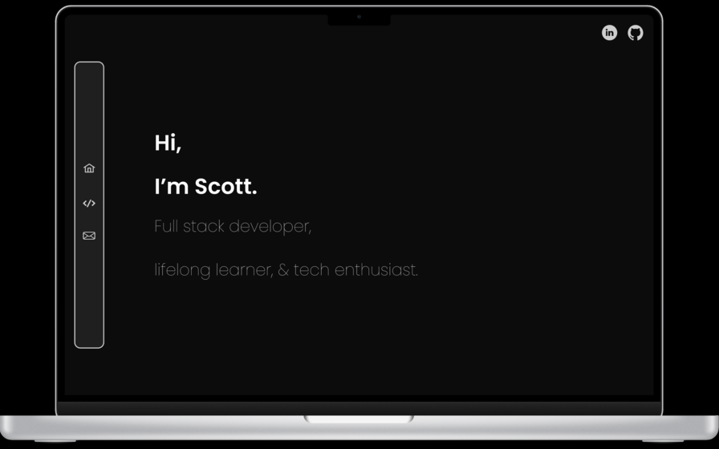
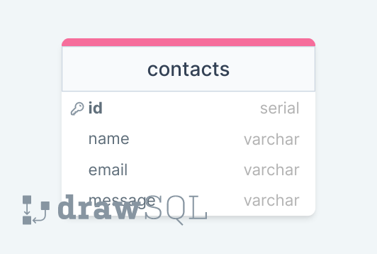

# Technologies 
This project is built using a range of modern web technologies:
- **Frontend**: JavaScript, HTML, CSS, React.js, Vite
- **Backend**: Node.js, Express.js
- **Database**: PostgreSQL

## Figma Design
Explore the Figma design for this project:
- [View Portfolio Prototype on Figma](https://www.figma.com/proto/nV4xeVGA9RGxRJeEBQ1kQ0/portfolio?page-id=0%3A1&type=design&node-id=34-2&viewport=-1174%2C574%2C0.52&t=QoRauYkD852cO1Ha-1&scaling=scale-down&mode=design)

<!-- <iframe width="50%" style="border: 1px solid rgba(0, 0, 0, 0.1);"  height="450" src="https://www.figma.com/embed?embed_host=share&url=https%3A%2F%2Fwww.figma.com%2Fproto%2FnV4xeVGA9RGxRJeEBQ1kQ0%2Fportfolio%3Fpage-id%3D0%253A1%26type%3Ddesign%26node-id%3D34-2%26viewport%3D-1174%252C574%252C0.52%26t%3DQoRauYkD852cO1Ha-1%26scaling%3Dscale-down%26mode%3Ddesign" allowfullscreen></iframe> -->

## drawSQL ERD
Entity Relationship Diagram (ERD):
- [View ERD on DrawSQL](https://drawsql.app/teams/team-scott-1/diagrams/rfs-mvp/embed)

<!-- <iframe width="50%" height="450" style="box-shadow: 0 2px 8px 0 rgba(63,69,81,0.16); border-radius:15px;" allowtransparency="true" allowfullscreen="true" scrolling="no" title="Embedded DrawSQL IFrame" frameborder="0" src="https://drawsql.app/teams/team-scott-1/diagrams/rfs-mvp/embed"></iframe> -->

## Learning Points
Throughout the development of this project, key learning areas included:
- React prop drilling
- Use of CSS modules for styling
- Dynamic SVG fills
- Integration of anime.js for animations
- Embedded iframes in markdown

## Work in Progress (WIP)
Ongoing development and enhancements are focused on:
- Implementing vitest for unit testing
- Integrating cypress for end-to-end testing
- Optimizing media queries for improved mobile responsiveness
- Preparing for deployment to [scottshannon.dev](https://scottshannon.dev)

<!-- # Full-Stack React Example

This repo contains an example of a full-stack application with an express backend and a React frontend.

It uses vite as the module bundler and dotenv for configuration. It's organized as a mono-repo using [npm workspaces](https://docs.npmjs.com/cli/v7/using-npm/workspaces) which allows us to have our client and server in one repo.

> **Note**: When you run `npm install` at the root, it will install all dependencies listed in `package.json`, `server/package.json`, and `client/package.json`.

## Customizing the Template

1. Create new repo using this one as a template.
1. Pull that repo down.
1. Update `./server/migration.sql` to the schema for your application.

## Development Setup

1. Install dependencies: `npm install`
1. Create your database: `createdb YOUR_DB`
1. Run your migrations: `psql -f server/migration.sql YOUR_DB`
1. Create your `.env` file: `cp .env.template .env`
1. Add your info in `.env`
1. Run the app: `npm run dev`

## Scripts

**Root**

- `npm run dev` - Runs the API server and hosts your frontend assets.
- `npm run dev:server` - Runs the API server in watch mode.
- `npm run dev:client` - Hosts your frontend assets.

**/client**

- `npm run dev` - Hosts your assets.
- `npm run build` - Builds your assets (mainly used in CI/CD).

**/server**

- `npm run dev` - Runs the server in watch mode.
- `npm run start` - Starts the server (mainly used when deploying).
